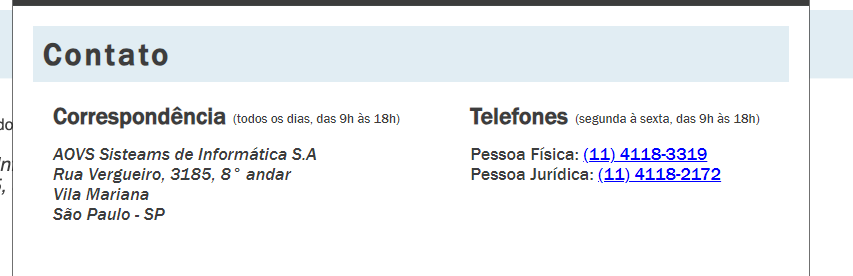

<h2>Página Simples de Contato feito com CSS e HTML PURO</h2>

Bom vi esse exercício na alura focado em praticar a semântica do html, eu peguei e comecei a fazer.
  Foi bem simples de realizar, e curti muito pois sozinho consegui entender o porque de tal código está ali.

<h2>Linguagens utilizadas: </h2>

  
  
  

<h2>Foto do Exercício</h2>

<h2>Foto do Exercício Finalizado</h2>

###
